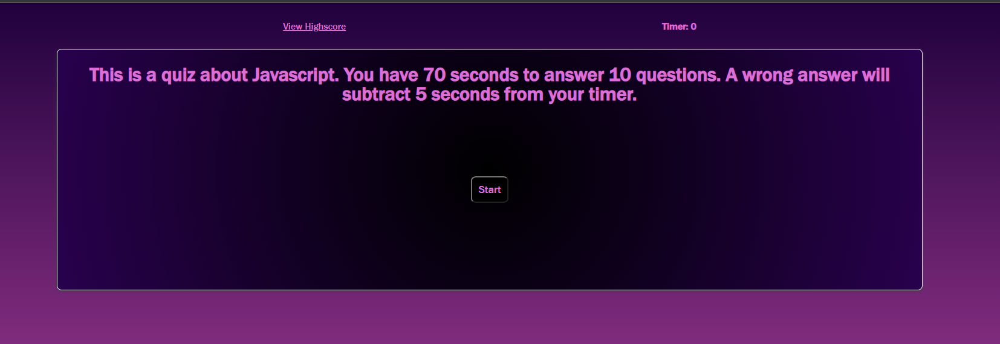
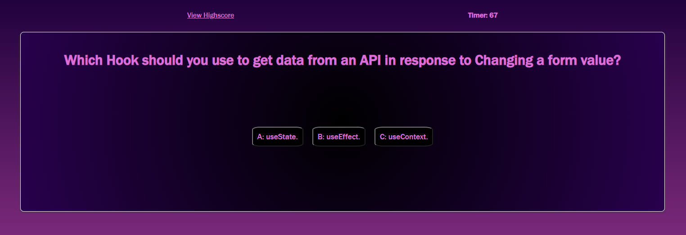
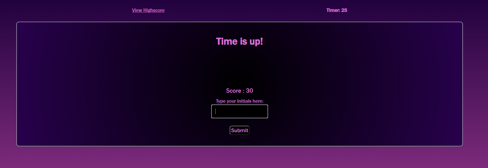
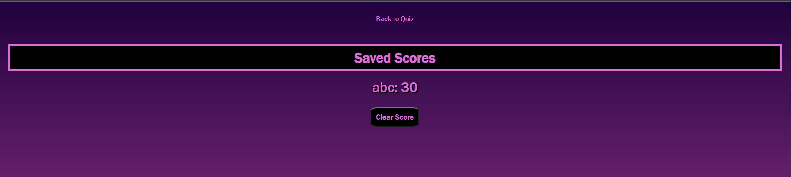

# Code Quiz

## [Code Quiz Page](https://jsnyder159.github.io/CodeQuiz/)

## Description 
I was tasked with creating a quiz on JavaScript fundamentals that stores high scores to compare my progress against my peers.

I am to make a quiz that when the start button is clicked a timer starts and I am presented with a question.  When I answer the question then another question is presented.  If the question is answered incorrectly time is subtracked from the timer.  When all questions are answered or the timer reaches zero than the game is over.  When the game is over then I can save my initials and my score.

Steps taken:

- Created two .html files.  One for the quiz and one for the high score.

- Created two .js files.  One for the quiz and one for the high score.

- Linked .js and .css files to appropriate pages.

- Labeled both .html pages with appropriate ID and Class tags for ease of formating.

- Defined global variables, including an array with the questions, three question choices, and correct answer.

- Made a function that loads on page load to explain the quiz with a start button on display.

- When the start button is clicked the quiz starts and a timer of 70 is given.  It ticks down by 1 every second.  

- When questions are displayed three option buttons are displayed below it.

- Each button checks if it the correct or incorrect answer.  If it is the correct answer points are added to your score. If its incorrect 5 seconds are deducted from the score.

-  When the timer reaches zero or all ten questions are asked the end screen is displayed.

-  You are presented with your score, and an input box to put your initials and a submit button.

- Upon clicking the submit button your initials and score are saved to the local storage, and you are sent to the High Score screen.

- Once at the high score screen a function is run that will create <li> elements and display your initials and score associated with it on the screen.

- A clear score button is present that if clicked will clear local storage and reload the page to show an empty area for saving your score.

- A high score button is on the main page to navigate to the high score page.  And a back to quiz button is present on the high score page to send you back to the main page where the start button to start the quiz is located.

